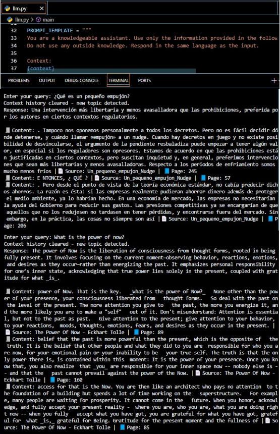

# Steps to set up the environment

1. Install the libraries listed in requirements.txt.
2. Create an .env file and define your OPENROUTER_API_KEY with your own API KEY.
3. Store all the documents you want to use as your knowledge base (in PDF format) in the data/rawdocs folder.
4. Execute createvectordatabase.py to create your vector database (which serves as your knowledge base).
5. Execute llm.py and ask questions based on your knowledge base.

