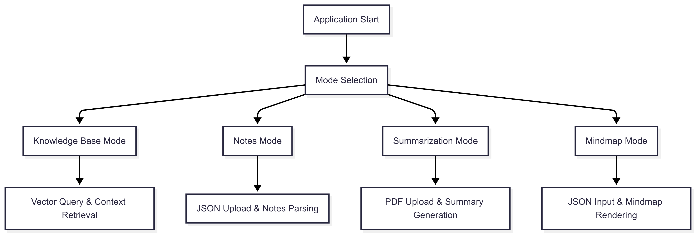

# 📐 System Architecture

## Purpose and Scope
This document provides a comprehensive overview of the internal architecture of the LLM-based Retrieval-Augmented Generation (RAG) knowledge management system.  

It details the structural organization of components, data flow patterns, storage mechanisms, and integration points across system layers.  

The architecture emphasizes modularity, with clear separation of concerns between the user interface, core processing logic, data storage, and external service integrations.

## 📑 Table of Contents

1. [Relevant Source Files](#relevant-source-files)
2. [Core System Structure](#core-system-structure)
   - [Architecture Diagram](#architecture-diagram)
3. [Layers Description](#layers-description)
   - [Presentation Layer](#presentation-layer)
   - [Application Logic Layer](#application-logic-layer)
   - [Data Processing Layer](#data-processing-layer)
   - [Storage Layer](#storage-layer)
   - [External Integrations](#external-integrations)
4. [Component Interaction Patterns](#component-interaction-patterns)
   - [Interaction Flow Diagram](#interaction-flow-diagram)
5. [Data Storage Architecture](#data-storage-architecture)
   - [Storage Architecture Diagram](#storage-architecture-diagram)
6. [Technology Integration Points](#technology-integration-points)
   - [Core Framework Dependencies](#core-framework-dependencies)
   - [External Service Integrations](#external-service-integrations)
   - [Integration Diagram](#integration-diagram)
7. [Operational Flow Architecture](#️operational-flow-architecture)
   - [Operational Flow Diagram](#operational-flow-diagram)
8. [Steps to set up the environment](#steps-to-set-up-the-environment)

---

## Relevant Source Files
- `main.py`
- `knowledgebase.py`
- `loadingasknotes.py`
- `summingupbookarticle.py`
- `generatingmindmapnotes.py`
- `summingupwebsite.py`
- `createvectordatabase.py`
- `utils.py`
- `prompt.py`
- `highlightviewpdf.py`
- `databases/*`
- `.gitignore`
- `requirements.txt`

---

## Core System Structure
The system adopts a layered architecture with five primary layers:  
- Presentation
- Application Logic
- Data Processing
- Storage
- External Integrations

The Streamlit web application (`main.py`) serves as the central coordinator, orchestrating interactions between functional modules.

### Architecture Diagram

---

## Layers Description

### Presentation Layer

* Files: `main.py`, Streamlit
* Handles user interactions via a web interface.
* Uses `st.session_state` for state management.
* Supports mode selection for different functionalities.

### Application Logic Layer

* Files: `knowledgebase.py`, `loadingasknotes.py`, etc.
* Implements core functionality for querying, summarization, and visualization.
* Coordinates data flow between UI, processing, and storage.

### Data Processing Layer

* Files: `createvectordatabase.py`, `utils.py`
* Manages document ingestion, chunking (`RecursiveCharacterTextSplitter`), and embedding generation (`HuggingFaceEmbeddings`).
* Prepares data for storage and retrieval.

### Storage Layer

* Location: `databases/*`
* Uses Chroma for vector storage (`databases/chroma/`).
* Stores JSON notes, PDFs, markdown pages, and mind maps.

### External Integrations

* OpenRouter API: LLM inference via HTTP REST.
* `markmap-cli`: Generates interactive mind maps.

---

## Component Interaction Patterns

The system employs distinct workflows per mode: input processing, LLM interaction, and output generation.

### Interaction Flow Diagram

---

## Data Storage Architecture

The system uses a multi-modal storage strategy optimized by content type and access pattern.

| Storage Type    | Location                          | Purpose                      | Access Pattern        |
| --------------- | --------------------------------- | ---------------------------- | --------------------- |
| Vector Database | `databases/chroma/`               | Semantic search, RAG context | Query-based retrieval |
| JSON Notes      | `databases/jsonnotes/`            | Structured note storage      | File-based read/write |
| PDF Repository  | `databases/pdfbooksarticles/`     | Original document storage    | Direct file access    |
| Markdown Pages  | `databases/markdownwebsitepages/` | Web content cache            | Sequential processing |
| Mindmap Files   | `databases/mindmapsnotes/`        | Generated visualizations     | Static file serving   |

### Storage Architecture Diagram

---

## Technology Integration Points

### Core Framework Dependencies

| Technology            | Version  | Integration Point    | Purpose                  |
| --------------------- | -------- | -------------------- | ------------------------ |
| streamlit             | ==1.47.0 | Primary UI framework | Web application hosting  |
| langchain             | ==0.3.26 | RAG orchestration    | LLM workflow management  |
| chromadb              | ==1.0.15 | Vector storage       | Semantic search backend  |
| sentence-transformers | ==5.0.0  | Text embeddings      | Document vectorization   |
| PyMuPDF               | ==1.26.3 | PDF processing       | Document parsing         |

### External Service Integrations

* **OpenRouter API**

  * Model: `deepseek-r1-0528:free`
  * Access: HTTP REST with `OPENROUTER_API_KEY`
  * Purpose: LLM inference

* **markmap-cli**

  * Access: Subprocess calls via `NPX_CMD_PATH`
  * Purpose: Generate interactive mind maps

### Integration Diagram

---

## Operational Flow Architecture

The system supports five operational modes, each with specialized logic on shared infrastructure.

* **Knowledge Base Mode**: Vector database querying.
* **Notes Mode**: Interaction with JSON notes.
* **Summarization Mode**: PDF summarization.
* **Mindmap Mode**: Generate mind maps.
* **Website Mode**: Summarize web content (currently disabled).

### Operational Flow Diagram

# Steps to set up the environment

1. Install the libraries listed in requirements.txt.
2. Create an .env file and define your OPENROUTER_API_KEY with your own API KEY and NPX_CMD_PATH with your own [markmap-cli](https://markmap.js.org/docs/packages--markmap-cli) path.
3. Store all the documents you want to use as your knowledge base (in PDF format) in the data/rawdocs folder.
4. Execute createvectordatabase.py to create your vector database (which serves as your knowledge base).
5. Execute main and you can query your knowledge base, ask about one or multiple notes, create notes using Feynman's methodology, or generate a mind map of any of your notes.

